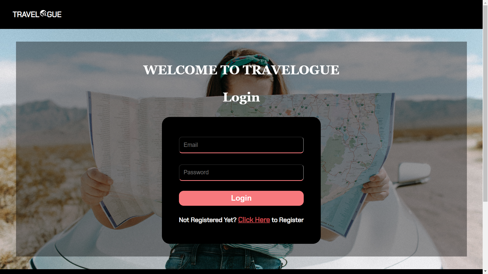
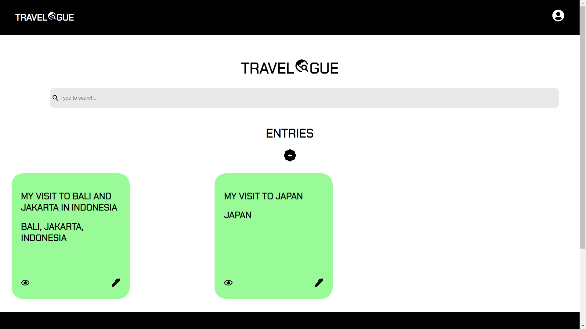
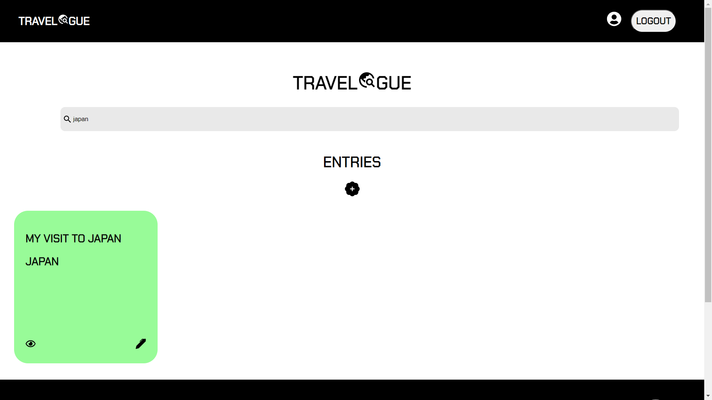
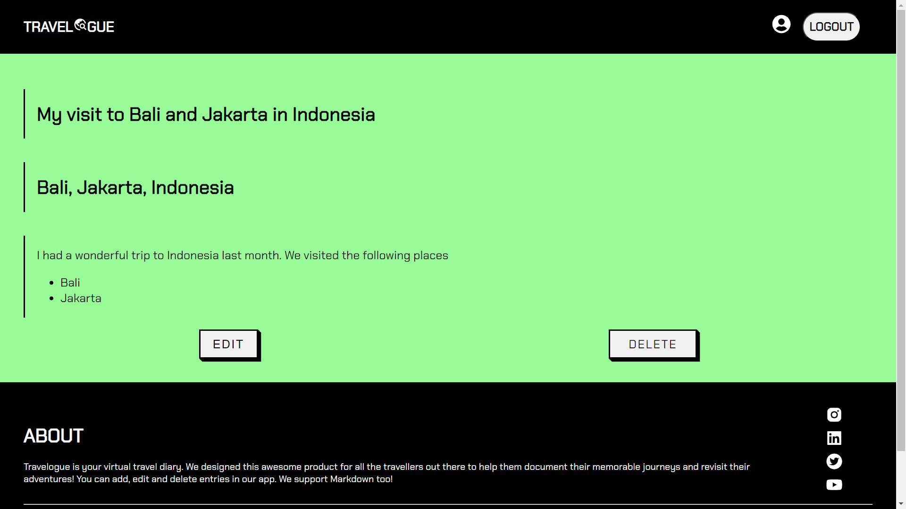
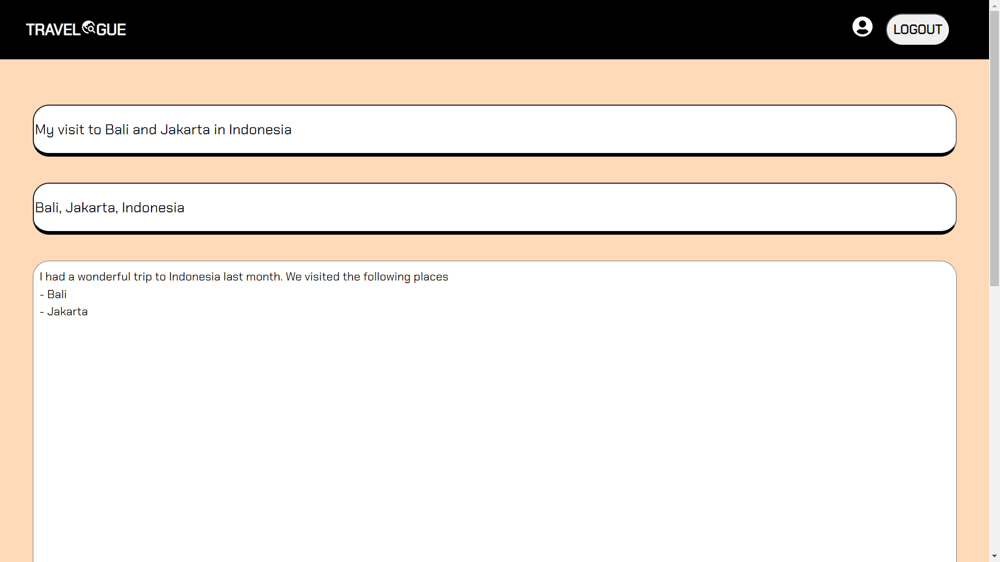
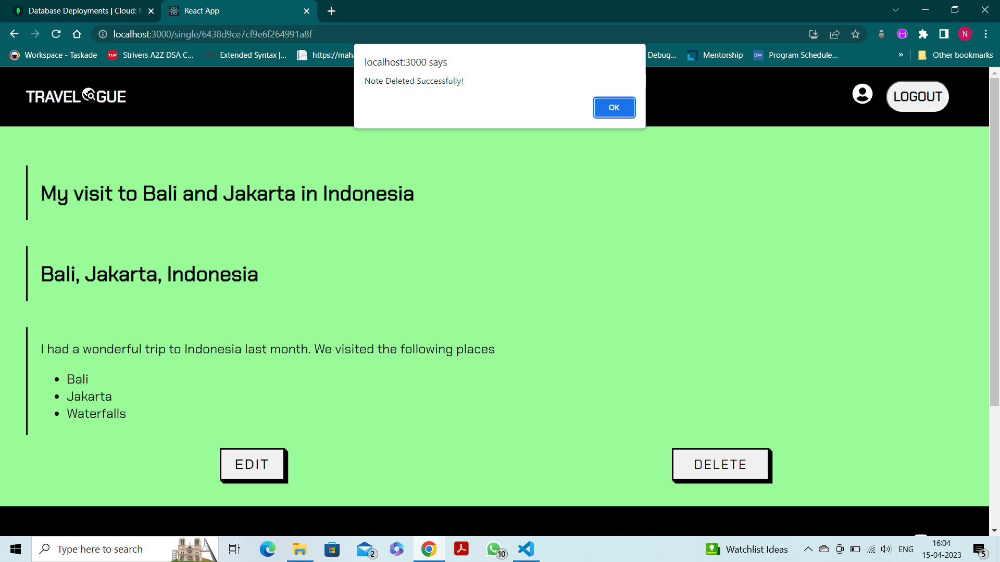
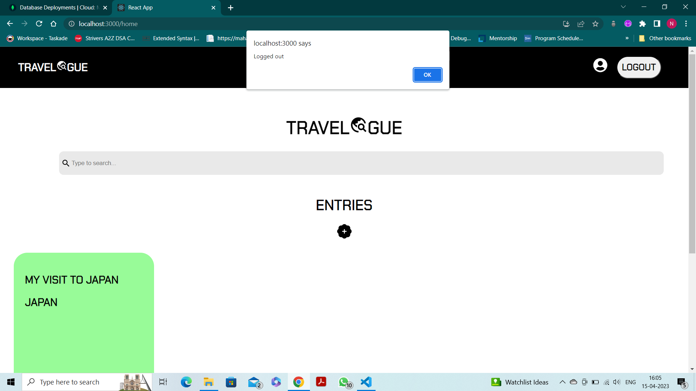

# TRAVELOGUE

Developed a virtual travel diary app for avid travel enthusiasts to document all their adventures. 

## 💻 Built With

➡ HTML
➡ CSS
➡ ReactJS
➡ NodeJS
➡ ExpressJS
➡ MongoDB
➡ React-Markdown

## 💻 Working

- User can register and login
- The home page displays all the diary entries
- User can add new entry with details like title, places visited and journey details.
- Markdown is also supported
- User can then view their new entry and edit as well as delete it
- User can search for specific notes
- User can log out off the app

## 💻 GUI

📍 Login Page

📍 Register Page

📍 Home Page

📍 Search Note

📍 Note Page

📍 Edit Note Page

📍 Delete Note

📍 Logout 

